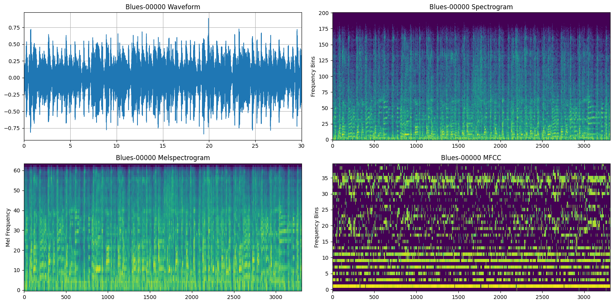
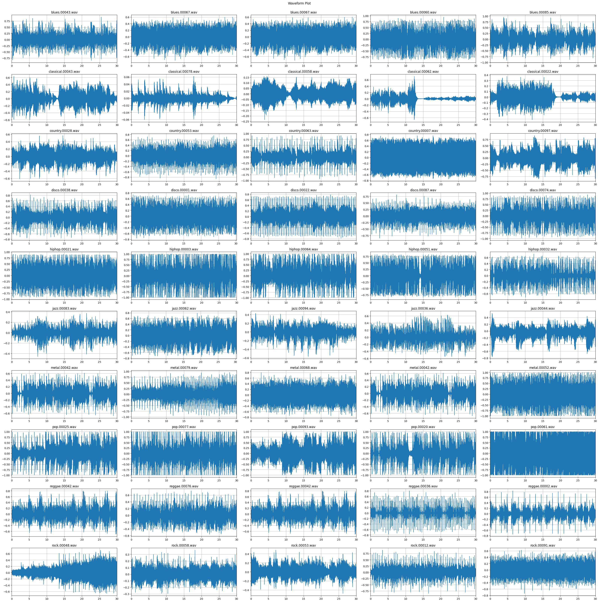
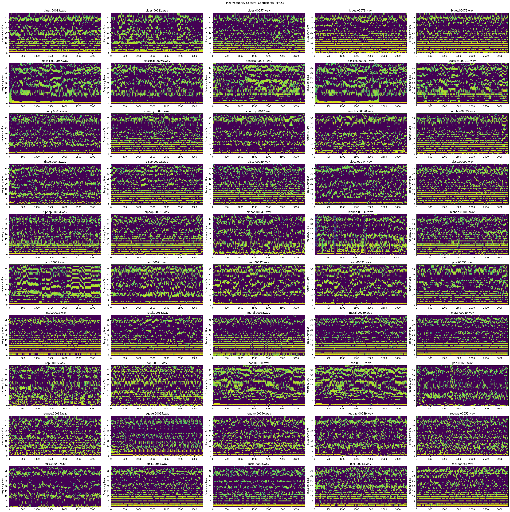
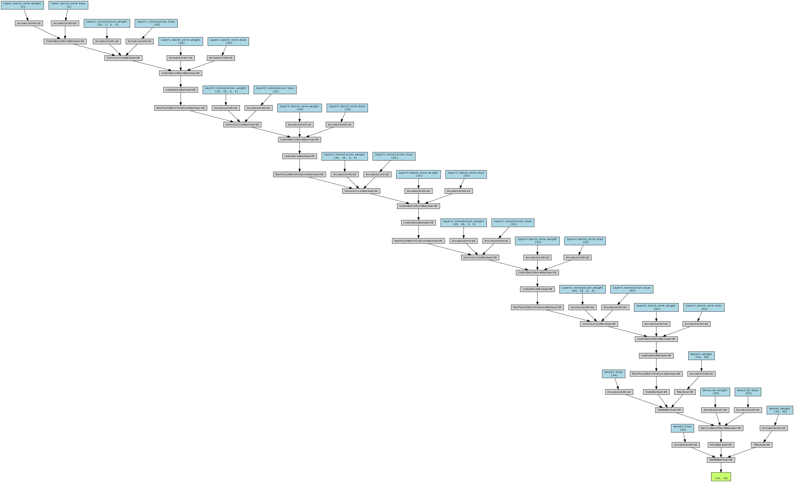
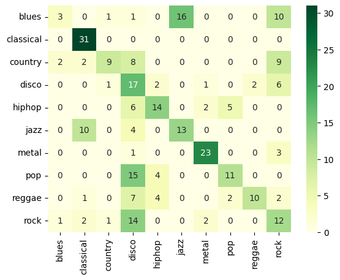

# Empirical Analysis of Music Genre Classification using CNNs #

## Results ##

### Features for `blues.00000.wav` ###

### Random Waveplots ###

### Random Spectrograms ###

### Random Melspectrograms ###

### Random MFCCs ###

## Trivial Model ##

### Architecture ###

### Evaluation - Confusion Matrix ###

